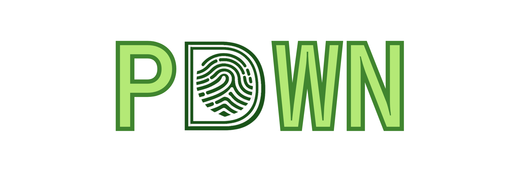

<h1 align="center">PDWN</h1>

<p align="center">
  Personal Data Watch & Neutralize<br/>
  A local-first desktop app to detect personal data and technical secrets before they become incidents.
</p>

<p align="center">
  
  
  
  
  
</p>

<p align="center">
  
</p>

## Why PDWN

Personal data and secrets often leak through normal workflows: downloads, exports, attachments, and temporary files.
PDWN helps you catch these files early by scanning locally, scoring risk clearly, and showing why a file is flagged.

## Core features

- Local scanning of watched folders and downloaded files
- Detection for PII, IDs, financial data, and technical secrets
- Risk scoring with explainable findings
- Locale-aware and custom YAML detection types
- No mandatory cloud dependency for core usage

## Privacy model

- Analysis runs on your machine
- Revealed sensitive values are not persisted in reports
- You keep control over what gets scanned and how findings are handled

## Tech stack

- Desktop shell: Tauri 2 + Rust
- Frontend: Vite + TypeScript
- i18n: i18next
- Quality: Biome, cargo fmt, clippy, Rust tests

## Quick start

### Prerequisites

- Bun
- Rust toolchain (stable)
- Tauri system dependencies for your OS

### Run in development

```bash
bun install
bun tauri dev
```

### Build release binaries

```bash
bun tauri build
```

## Developer commands

```bash
# Full quality gate (TS + formatting + i18n + Rust)
bun run check

# Integration dataset consistency
bun run test:integration

# Refresh dataset then run integration test
bun run test:integration:refresh
```

## Project standards

CI validates:

- Type checking, linting, and formatting
- Rust fmt, clippy, and test suite
- Security scans and dependency auditing
- Coverage gate on Rust checks

## Contributing

If you want to contribute, start here:

- `CONTRIBUTING.md`
- `SECURITY.md`
- `CODE_OF_CONDUCT.md`

## License

PDWN is licensed under `AGPL-3.0-only`.
